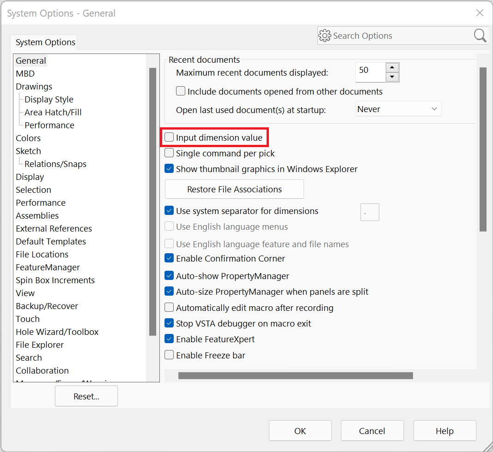

# SolidWorks-Automation

## Project Overview

This is a small repo I will be using to keep up with some small programs I am working on to automate the creation of basic SolidWorks parts we commonly make in HPRC. If you are in HPRC and are interested in how the program works or want to help on the project, feel free to reach out to me. I am also open to suggestions on what other parts would be beneficial for me to automate the creation of.

I took inspiration for this project from [lindahu123](https://github.com/lindahu123), her original repo can be found [here](https://github.com/lindahu123/Solidworks-Macros).

## Installation

In order to run this code, all you need is access to SolidWorks and a build of Python. This is tested to be working on Python 3.

You will need to install **pywin32** which is how the program interfaces with the Windows API. To install pywin32, all you have to do is run the command `pip install pywin32`. You can also run `pip install -r requirements.txt` when running terminal inside of the SolidWorks-Automation folder. These will do the same things since pywin32 is currently the only requirement for this program.

In order for the program to function properly, you will also want to go into SolidWorks Settings and toggle off "Input dimension value." This can be found in Tools>Options>General as shown below.

## Using the Program

Be sure to **launch solidworks before you run the python program**. Solidworks needs to be running in order to dispatch to it.

I am currently creating a GUI to run the program at the moment, right now the only way to run the program is to run the `main.py` file. You must edit the values in the `main.py` file in order the change the dimensions of the bulkhead.
